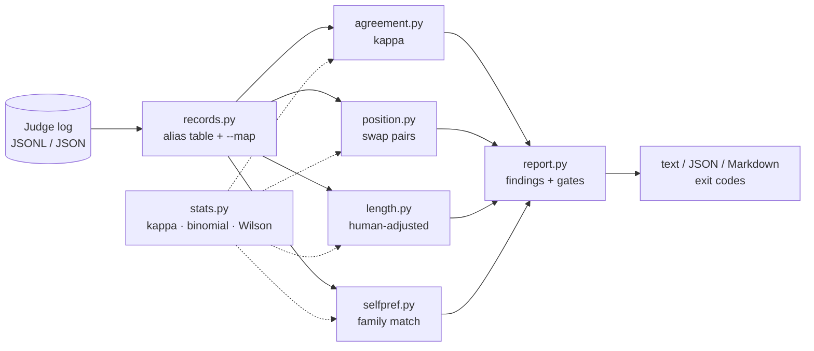

# judgecal

[English](README.md) | [中文](README.zh.md) | [日本語](README.ja.md)

[](LICENSE) [](CHANGELOG.md) [](pyproject.toml)  [](CONTRIBUTING.md)

**LLM-as-judge ログのオープンソース監査ツール——手元のログから人間との一致度（kappa）、位置バイアス、長さバイアス、自己選好をオフラインで算出。モデルは一切呼び出さない。**


```bash
git clone https://github.com/JaydenCJ/judgecal && cd judgecal && pip install -e .
```

> **プレリリース：** judgecal はまだ PyPI に公開されていません。初回リリースまでは [JaydenCJ/judgecal](https://github.com/JaydenCJ/judgecal) をクローンし、リポジトリのルートで `pip install -e .` を実行してください。

## なぜ judgecal？

評価数値の信頼性は、それを産み出したジャッジの信頼性で決まります。そして LLM ジャッジは、先に見た回答・長い回答・自分と同じモデルファミリーの回答を好むことで知られています。経営層に「このスコアをなぜ信じられるのか？」と問われたとき、勝率だけでは答えになりません——提示できる証拠が必要です。既存ツールはそれを出せません：評価フレームワークはジャッジを*実行*するだけで監査せず、論文のバイアス分析は使い捨ての notebook の中にあります。judgecal はその欠けていた事後監査ツールです。手元のペアワイズなジャッジログを指定すれば、人間の抜き取りラベルとの Cohen's kappa、スワップ一貫性分析つきの位置バイアス、そして*同じ行における人間ベースラインを差し引いた*長さ・自己選好バイアスを算出します——本物の品質差がバイアスとして誤計上されることはありません。ローカルファイルを 1 つ読んで出力するだけ。モデルを呼ばないので、監査は無料・即時・再現可能です。

|  | judgecal | DeepEval | promptfoo | 手書き notebook |
|---|---|---|---|---|
| 既存のジャッジログをオフラインで監査 | はい | いいえ（評価を実行） | いいえ（評価を実行） | 書けばできる |
| 偶然一致を補正した人間一致度（Cohen's kappa） | はい | いいえ | いいえ | scipy + グルーコード |
| スワップペア一貫性つきの位置バイアス | はい | いいえ | いいえ | 正しくやる例は稀 |
| 人間ベースラインを差し引いた長さ / 自己選好 | はい | いいえ | いいえ | 正しくやる例は稀 |
| ジャッジ品質への CI ゲート（終了コード） | はい | 評価スコアのみ | 評価スコアのみ | いいえ |
| 実行に API キーが必要 | いいえ | はい | はい | いいえ |
| ランタイム依存 | 0 | 29 | 100+（npm） | pandas + scipy |

<sub>依存数は 2026-07 に確認：DeepEval 4.0.7 は PyPI 上で 29 のランタイム依存を宣言し、promptfoo のインストールは 100 以上の npm パッケージを解決します。judgecal の数は [pyproject.toml](pyproject.toml) の `dependencies = []` の通りです。</sub>

## 特徴

- **1 コマンドで 4 つの監査** — `judgecal audit log.jsonl` が人間一致度・位置バイアス・長さバイアス・自己選好を報告し、それぞれに明快な OK / WARN / FLAG の所見と裏付けの数値が付きます。
- **誠実なバイアス計算** — 長さと自己選好は品質と交絡するため、judgecal は同じ行での人間側の比率を計算して差分を報告します。人間も長い回答を好むから長い回答を選ぶジャッジは、フラグされません。
- **本物の統計、依存ゼロ** — Landis & Koch の解釈バンド付き Cohen's kappa、正確な両側二項検定、Wilson 95% 信頼区間。すべて標準ライブラリ実装で、テストスイートで教科書の値に固定されています。
- **スワップ一貫性分析** — 同じプロンプトを両方の順序で判定した行（`pair_id` で連結）をペアにし、モデルではなくスロットを追いかける判定を first-sticky / second-sticky として数えます。
- **ログをそのまま読む** — JSONL でも JSON 配列でも可。一般的なフィールド名のエイリアス表（`winner`、`choice`、`judgement` など）、ネストしたレスポンスオブジェクトに対応し、残りは `--map field=key` で解決。壊れた行は行番号付きでスキップされ、監査を落としません。
- **CI 対応** — `--min-kappa 0.4 --max-position-delta 0.05` で監査が終了コード 1 のゲートになり、ゲート対象の指標が測れないときは失敗扱い（fail closed）。機械可読な JSON（`schema_version: 1`）と PR コメント向け Markdown も出力できます。

## クイックスタート

インストール：

```bash
git clone https://github.com/JaydenCJ/judgecal && cd judgecal && pip install -e .
```

同梱のデモログ（3 種のバイアスを仕込んだシード固定シミュレーション）を生成して監査します：

```bash
python examples/generate_demo_log.py demo-log.jsonl
judgecal audit demo-log.jsonl
```

出力（実行結果からコピー。agreement と length のセクションは `...` で省略）：

```text
judgecal 0.1.0 — demo-log.jsonl
rows: 240  parsed: 240  skipped: 0  judges: aurora-8b
verdicts: a=136  b=88  tie=16  (tie rate 6.7%)

[agreement] Human agreement (n=240 labeled)
    observed agreement   72.1%
    Cohen's kappa        0.521  (moderate)
    ...
    -> WARN: kappa 0.521 (moderate): usable, but spot-check disagreements

[position] Position bias (n=224 decisive, 16 ties)
    first-position wins  136/224 = 60.7%  [95% CI 54.2%-66.9%]  p=0.0016
    swap pairs           80 linked  ->  consistent 48, first-sticky 24, second-sticky 6, mixed 2
    swap consistency     60.0%
    -> FLAG: first-position answers win 60.7% (p=0.0016); randomize or swap-average
    -> WARN: swap consistency 60.0%: verdicts change when you swap the order

[length] Length bias (n=224 compared)
    longer answer wins   133/224 = 59.4%  [95% CI 52.8%-65.6%]  p=0.0060
    ...
    human baseline       judge 58.6% vs human 41.9%  (adjusted delta 0.167, n=210)
    -> WARN: longer answer wins 59.4% (p=0.006); +16.7 pts over humans

[self] Self-preference (n=99 decisive self-vs-other, 4 ties)
    judges matched       aurora-8b
    own model wins       71/99 = 71.7%  [95% CI 62.2%-79.7%]  p=1.8e-05
    human baseline       judge 71.4% vs human 54.9%  (adjusted delta 0.165, n=91)
    -> FLAG: judge picks its own model 16.5 pts more often than humans do on the same rows

overall: FLAG
```

そのまま CI のゲートに——同じ監査にしきい値を付ければ、違反時に終了コード 1 になります：

```bash
judgecal audit demo-log.jsonl --min-kappa 0.4 --max-position-delta 0.05
```

```text
judgecal: FAIL: gate --max-position-delta 0.05: delta is 0.1071
```

自前のログは 1 行 1 JSON オブジェクトで、最低限 `verdict`（`a`/`b`/`tie`）があれば動きます。フィールドが増えるほどチェックが増えます。一般的なエクスポートのフィールド名は自動検出され、残りは `--map` で対応——詳しくは [`docs/log-format.md`](docs/log-format.md) を参照してください。

## コマンドとオプション

| コマンド | 内容 |
|---|---|
| `judgecal audit LOG` | 4 チェックすべて、所見、総合判定、任意のゲート |
| `judgecal agreement LOG` | 人間一致度のみ：kappa、混同行列、引き分け率 |
| `judgecal position LOG` | 位置バイアスのみ：先頭勝率、スワップ一貫性 |
| `judgecal length LOG` | 長さバイアスのみ：長い回答の勝率、比率バケット、人間との差分 |
| `judgecal self LOG` | 自己選好のみ：自モデル勝率、人間との差分 |
| `judgecal validate LOG` | 行単位の問題を報告するパース検査。スキップ行があれば終了コード 1 |

| キー | 既定値 | 効果 |
|---|---|---|
| `--format` | `text` | 出力形式：`text`、`json`（キーソート、`schema_version: 1`）、`markdown` |
| `--map FIELD=KEY` | — | 正規フィールドごとにエイリアス表を上書き（繰り返し指定可） |
| `--judge NAME` | — | 特定のジャッジのレコードだけを監査（大文字小文字を無視した完全一致） |
| `--min-n N` | `10` | サンプル数がこれ未満のチェックは判定せず NO DATA を報告 |
| `--exact-self` | オフ | 自己選好でファミリー一致ではなくモデル名の完全一致を要求 |
| `--min-kappa` / `--max-*-delta` | — | `audit` のみ：CI ゲート。違反（またはゲート対象指標が測定不能）で終了コード 1 |

## レポートの読み方

既定の所見しきい値（p 値が関わる箇所では FLAG に p < 0.05 の統計的有意性が必要）：

| チェック | WARN の条件 | FLAG の条件 |
|---|---|---|
| 人間一致度 | kappa < 0.60 | kappa < 0.40 |
| 位置バイアス | 先頭勝率が 50% から 5 pt 以上乖離 | 50% から 10 pt 以上乖離 |
| スワップ一貫性 | 80% 未満 | 50% 未満 |
| 長さバイアス | 長い回答の勝率が 50% から 8 pt 以上乖離 | 50% から 15 pt 以上乖離 |
| 自己選好 | 人間の比率を 5 pt 以上上回る | 人間の比率を 10 pt 以上上回る |

位置バイアスを 2 通りで測るのは、壊れ方が異なるためです：先頭勝率は（A/B 順序がランダム化されている前提で）全体のドリフトを捉え、スワップ一貫性は「同じプロンプトで順序を入れ替えたら判定が変わったか？」を直接問う——これにより位置要因を品質から完全に切り離せます。人間ラベルがない場合、自己選好の所見は生の自モデル勝率にフォールバックし、その旨を明記します。強いジャッジモデルの回答は正当に強い可能性があるからです。

## 検証

このリポジトリは CI を同梱しません。上記の主張はすべてローカル実行で検証されています。このリポジトリのチェックアウトから再現できます：

```bash
pip install -e '.[dev]' && pytest && bash scripts/smoke.sh
```

出力（実行結果からコピー、`...` で省略）：

```text
95 passed in 0.84s
...
SMOKE OK
```

## アーキテクチャ



## ロードマップ

- [x] ペアワイズログ監査：kappa、位置 + スワップ一貫性、人間ベースライン付きの長さ・自己選好、所見、CI ゲート、3 種類の出力形式（v0.1.0）
- [ ] ポイントワイズ（単独スコア）ログ：スコア較正と人間との相関
- [ ] 冗長性を統制した位置検定（スワップペアを長さ差で層別化）
- [ ] 複数ジャッジが混在するログのジャッジ別比較モード
- [ ] 複数の人間アノテーター向け Krippendorff's alpha
- [ ] PyPI への公開（`pip install judgecal`）

全リストは [open issues](https://github.com/JaydenCJ/judgecal/issues) を参照してください。

## コントリビュート

コントリビュート歓迎です——まずは [good first issue](https://github.com/JaydenCJ/judgecal/issues?q=is%3Aissue+is%3Aopen+label%3A%22good+first+issue%22) から、あるいは [discussion](https://github.com/JaydenCJ/judgecal/discussions) を立ててください。開発環境は [CONTRIBUTING.md](CONTRIBUTING.md) を参照。

## ライセンス

[MIT](LICENSE)
