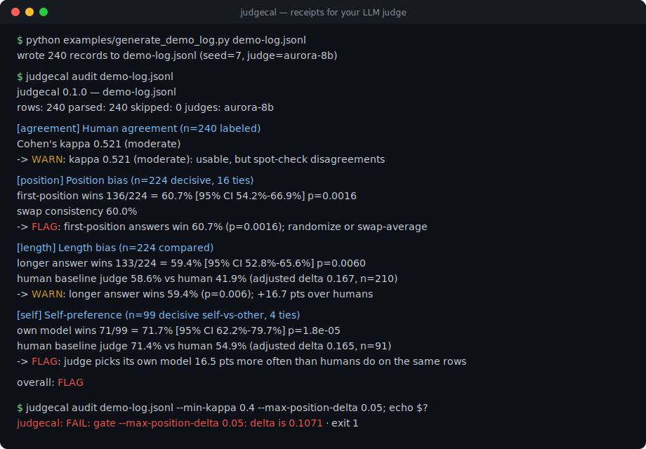
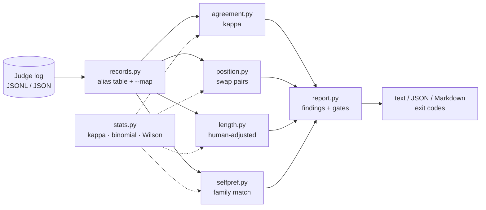

# judgecal

[English](README.md) | [中文](README.zh.md) | [日本語](README.ja.md)

[](LICENSE) [](CHANGELOG.md) [](pyproject.toml)  [](CONTRIBUTING.md)

**Open-source audits for LLM-as-judge logs — human agreement (kappa), position bias, length bias, and self-preference, computed offline from the logs you already have. Never calls a model.**



```bash
git clone https://github.com/JaydenCJ/judgecal && cd judgecal && pip install -e .
```

> **Pre-release:** judgecal is not yet published to PyPI. Until the first release, clone [JaydenCJ/judgecal](https://github.com/JaydenCJ/judgecal) and run `pip install -e .` from the repository root.

## Why judgecal?

Your eval numbers are only as trustworthy as the judge that produced them, and LLM judges are known to prefer the first answer they see, the longer answer, and answers from their own model family. When leadership asks "why should we believe these scores?", a win rate is not an answer — you need receipts. The existing tooling doesn't produce them: eval frameworks *run* judges but don't audit them, and the bias analyses in research papers live in one-off notebooks. judgecal is the missing post-hoc auditor: point it at the pairwise judge log you already have, and it computes Cohen's kappa against your human spot-checks, position bias with swap-consistency analysis, and length and self-preference biases *netted against a human baseline on the same rows* — so genuine quality differences don't get miscounted as bias. It reads one local file and prints; it never calls a model, so an audit is free, instant, and reproducible.

|  | judgecal | DeepEval | promptfoo | ad-hoc notebook |
|---|---|---|---|---|
| Audits existing judge logs offline | Yes | No (runs evals) | No (runs evals) | If you write it |
| Chance-corrected human agreement (Cohen's kappa) | Yes | No | No | scipy + glue code |
| Position bias with swap-pair consistency | Yes | No | No | Rarely done right |
| Length / self-preference netted against a human baseline | Yes | No | No | Rarely done right |
| CI gates on judge quality (exit codes) | Yes | On eval scores | On eval scores | No |
| Needs an API key to run | No | Yes | Yes | No |
| Runtime dependencies | 0 | 29 | 100+ (npm) | pandas + scipy |

<sub>Dependency counts checked 2026-07: DeepEval 4.0.7 declares 29 runtime requirements on PyPI; a promptfoo install resolves 100+ npm packages. judgecal's count is `dependencies = []` in [pyproject.toml](pyproject.toml).</sub>

## Features

- **Four audits, one command** — `judgecal audit log.jsonl` reports human agreement, position bias, length bias, and self-preference, each with a plain OK / WARN / FLAG finding and the numbers behind it.
- **Honest bias math** — length and self-preference are confounded by quality, so judgecal computes the human rate on the same rows and reports the delta; a judge that prefers longer answers *because humans do too* is not flagged.
- **Real statistics, zero dependencies** — Cohen's kappa with Landis & Koch bands, exact two-sided binomial tests, and Wilson 95% intervals, all standard library, all pinned to textbook values in the test suite.
- **Swap-consistency analysis** — rows that judge the same prompt in both orders (linked by `pair_id`) are paired up, and verdicts that chase a slot instead of a model are counted as first-sticky or second-sticky.
- **Reads your log as it is** — JSONL or JSON array, with an alias table for common field names (`winner`, `choice`, `judgement`, …), nested response objects, and `--map field=key` for everything else; broken lines are skipped with line numbers, never crash the audit.
- **CI-ready** — `--min-kappa 0.4 --max-position-delta 0.05` turns the audit into a gate that exits 1, fails closed when a gated metric can't be measured, and emits machine-readable JSON (`schema_version: 1`) and PR-comment Markdown.

## Quickstart

Install:

```bash
git clone https://github.com/JaydenCJ/judgecal && cd judgecal && pip install -e .
```

Generate the bundled demo log (a seeded simulation with three planted biases) and audit it:

```bash
python examples/generate_demo_log.py demo-log.jsonl
judgecal audit demo-log.jsonl
```

Output (copied from a real run; agreement and length sections truncated with `...`):

```text
judgecal 0.1.0 — demo-log.jsonl
rows: 240  parsed: 240  skipped: 0  judges: aurora-8b
verdicts: a=136  b=88  tie=16  (tie rate 6.7%)

[agreement] Human agreement (n=240 labeled)
    observed agreement   72.1%
    Cohen's kappa        0.521  (moderate)
    ...
    -> WARN: kappa 0.521 (moderate): usable, but spot-check disagreements

[position] Position bias (n=224 decisive, 16 ties)
    first-position wins  136/224 = 60.7%  [95% CI 54.2%-66.9%]  p=0.0016
    swap pairs           80 linked  ->  consistent 48, first-sticky 24, second-sticky 6, mixed 2
    swap consistency     60.0%
    -> FLAG: first-position answers win 60.7% (p=0.0016); randomize or swap-average
    -> WARN: swap consistency 60.0%: verdicts change when you swap the order

[length] Length bias (n=224 compared)
    longer answer wins   133/224 = 59.4%  [95% CI 52.8%-65.6%]  p=0.0060
    ...
    human baseline       judge 58.6% vs human 41.9%  (adjusted delta 0.167, n=210)
    -> WARN: longer answer wins 59.4% (p=0.006); +16.7 pts over humans

[self] Self-preference (n=99 decisive self-vs-other, 4 ties)
    judges matched       aurora-8b
    own model wins       71/99 = 71.7%  [95% CI 62.2%-79.7%]  p=1.8e-05
    human baseline       judge 71.4% vs human 54.9%  (adjusted delta 0.165, n=91)
    -> FLAG: judge picks its own model 16.5 pts more often than humans do on the same rows

overall: FLAG
```

Then gate it in CI — the same audit with thresholds exits 1 on violation:

```bash
judgecal audit demo-log.jsonl --min-kappa 0.4 --max-position-delta 0.05
```

```text
judgecal: FAIL: gate --max-position-delta 0.05: delta is 0.1071
```

Your own log needs one JSON object per line with at least a `verdict` (`a`/`b`/`tie`); every extra field unlocks another check. Field names from common exports are auto-detected, and `--map` handles the rest — see [`docs/log-format.md`](docs/log-format.md).

## Commands and options

| Command | What it does |
|---|---|
| `judgecal audit LOG` | All four checks, findings, overall verdict, optional gates |
| `judgecal agreement LOG` | Human agreement only: kappa, confusion matrix, tie rates |
| `judgecal position LOG` | Position bias only: first-win rate, swap consistency |
| `judgecal length LOG` | Length bias only: longer-win rate, ratio buckets, human delta |
| `judgecal self LOG` | Self-preference only: own-model win rate, human delta |
| `judgecal validate LOG` | Parse check with per-line issues; exits 1 if rows were skipped |

| Key | Default | Effect |
|---|---|---|
| `--format` | `text` | Output format: `text`, `json` (sorted keys, `schema_version: 1`), or `markdown` |
| `--map FIELD=KEY` | — | Override the field alias table per canonical field (repeatable) |
| `--judge NAME` | — | Audit only records from one judge (case-insensitive exact match) |
| `--min-n N` | `10` | Below this sample size a check reports NO DATA instead of a verdict |
| `--exact-self` | off | Self-preference requires an exact model-name match instead of family match |
| `--min-kappa` / `--max-*-delta` | — | `audit` only: CI gates; any violation (or unmeasurable gated metric) exits 1 |

## Reading the report

Default finding thresholds (a FLAG needs statistical significance at p < 0.05 where a p-value applies):

| Check | WARN when | FLAG when |
|---|---|---|
| Human agreement | kappa < 0.60 | kappa < 0.40 |
| Position bias | first-win rate 5+ pts from 50% | 10+ pts from 50% |
| Swap consistency | below 80% | below 50% |
| Length bias | longer-win rate 8+ pts from 50% | 15+ pts from 50% |
| Self-preference | 5+ pts above the human rate | 10+ pts above the human rate |

Position bias is measured two ways because they fail differently: the first-win rate catches aggregate drift (assuming randomized A/B order), while swap consistency directly asks "did swapping the order change the verdict on the same prompt?" — which isolates position from quality entirely. Without human labels the self-preference finding falls back to the raw own-side win rate and says so, since a strong judge model can legitimately have strong answers.

## Verification

This repository ships no CI; every claim above is verified by local runs. Reproduce them from a checkout of this repository:

```bash
pip install -e '.[dev]' && pytest && bash scripts/smoke.sh
```

Output (copied from a real run, truncated with `...`):

```text
95 passed in 0.84s
...
SMOKE OK
```

## Architecture



## Roadmap

- [x] Pairwise log auditor: kappa, position + swap consistency, length and self-preference with human baselines, findings, CI gates, three output formats (v0.1.0)
- [ ] Pointwise (single-score) logs: score calibration and human correlation
- [ ] Verbosity-controlled position test (stratify swap pairs by length gap)
- [ ] Per-judge comparison mode for logs that mix several judges
- [ ] Krippendorff's alpha for logs with more than one human annotator
- [ ] PyPI release with `pip install judgecal`

See the [open issues](https://github.com/JaydenCJ/judgecal/issues) for the full list.

## Contributing

Contributions are welcome — start with a [good first issue](https://github.com/JaydenCJ/judgecal/issues?q=is%3Aissue+is%3Aopen+label%3A%22good+first+issue%22) or open a [discussion](https://github.com/JaydenCJ/judgecal/discussions). See [CONTRIBUTING.md](CONTRIBUTING.md) for the development setup.

## License

[MIT](LICENSE)
