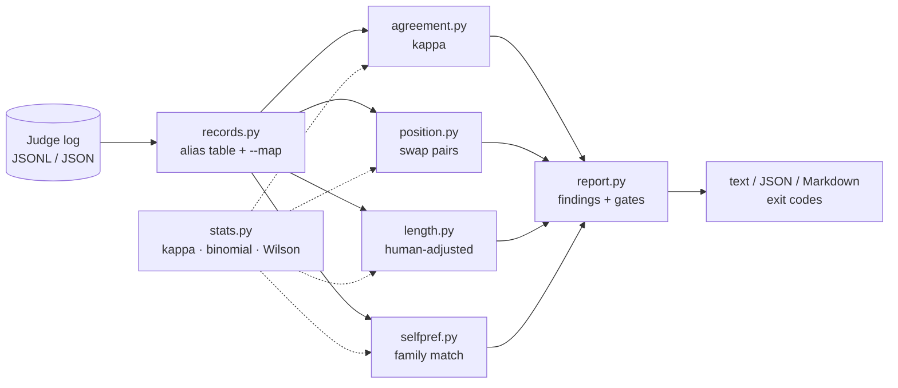

# judgecal

[English](README.md) | [中文](README.zh.md) | [日本語](README.ja.md)

[](LICENSE) [](CHANGELOG.md) [](pyproject.toml)  [](CONTRIBUTING.md)

**开源的 LLM-as-judge 日志审计工具——用你已有的日志离线计算人类一致性（kappa）、位置偏差、长度偏差和自我偏好。绝不调用任何模型。**


```bash
git clone https://github.com/JaydenCJ/judgecal && cd judgecal && pip install -e .
```

> **预发布：** judgecal 尚未发布到 PyPI。在首个正式版本之前，请克隆 [JaydenCJ/judgecal](https://github.com/JaydenCJ/judgecal) 并在仓库根目录执行 `pip install -e .`。

## 为什么选择 judgecal？

评测数字的可信度取决于产出它们的裁判，而 LLM 裁判是出了名地偏爱先看到的答案、更长的答案，以及来自自家模型系列的答案。当管理层问"凭什么相信这些分数？"时，一个胜率不是答案——你需要拿得出手的证据。现有工具给不出来：评测框架只*运行*裁判却不审计裁判，而论文里的偏差分析都躺在一次性的 notebook 里。judgecal 补上了这块缺失的事后审计：把它指向你已有的成对裁判日志，它就会计算裁判与人工抽检的 Cohen's kappa、带交换一致性分析的位置偏差，以及*在同一批行上扣除人类基线*的长度与自我偏好偏差——因此真实的质量差异不会被误算成偏差。它只读一个本地文件然后打印；它绝不调用模型，所以一次审计免费、即时、可复现。

|  | judgecal | DeepEval | promptfoo | 手写 notebook |
|---|---|---|---|---|
| 离线审计已有裁判日志 | 是 | 否（跑评测） | 否（跑评测） | 你自己写就有 |
| 机会校正的人类一致性（Cohen's kappa） | 是 | 否 | 否 | scipy + 胶水代码 |
| 带交换对一致性的位置偏差 | 是 | 否 | 否 | 很少做对 |
| 扣除人类基线的长度 / 自我偏好 | 是 | 否 | 否 | 很少做对 |
| 针对裁判质量的 CI 门禁（退出码） | 是 | 只针对评测分 | 只针对评测分 | 否 |
| 运行时需要 API key | 否 | 是 | 是 | 否 |
| 运行时依赖 | 0 | 29 | 100+（npm） | pandas + scipy |

<sub>依赖数量核对于 2026-07：DeepEval 4.0.7 在 PyPI 上声明了 29 个运行时依赖；安装 promptfoo 会解析出 100 多个 npm 包。judgecal 的数量就是 [pyproject.toml](pyproject.toml) 里的 `dependencies = []`。</sub>

## 功能特性

- **一条命令，四项审计** — `judgecal audit log.jsonl` 报告人类一致性、位置偏差、长度偏差和自我偏好，每项都附带直白的 OK / WARN / FLAG 结论和背后的数字。
- **诚实的偏差数学** — 长度和自我偏好会被质量混淆，所以 judgecal 在同一批行上计算人类的比率并报告差值；一个因为人类也偏爱长答案而偏爱长答案的裁判不会被误标。
- **真统计，零依赖** — 带 Landis & Koch 分级的 Cohen's kappa、精确双侧二项检验、Wilson 95% 置信区间，全部标准库实现，全部在测试套件中钉死到教科书数值。
- **交换一致性分析** — 以两种顺序裁判同一提示的行（通过 `pair_id` 关联）会被配对，追着位置而不是模型走的判决会被计为 first-sticky 或 second-sticky。
- **按原样读你的日志** — JSONL 或 JSON 数组，内置常见字段名别名表（`winner`、`choice`、`judgement` 等），支持嵌套响应对象，其余交给 `--map field=key`；坏行会带行号跳过，绝不让审计崩溃。
- **CI 就绪** — `--min-kappa 0.4 --max-position-delta 0.05` 把审计变成退出码为 1 的门禁，被门禁的指标测不出来时按失败处理（fail closed），并能输出机器可读 JSON（`schema_version: 1`）和适合 PR 评论的 Markdown。

## 快速上手

安装：

```bash
git clone https://github.com/JaydenCJ/judgecal && cd judgecal && pip install -e .
```

生成自带的演示日志（一个植入了三种偏差的固定种子模拟）并审计它：

```bash
python examples/generate_demo_log.py demo-log.jsonl
judgecal audit demo-log.jsonl
```

输出（复制自真实运行；agreement 和 length 部分用 `...` 截断）：

```text
judgecal 0.1.0 — demo-log.jsonl
rows: 240  parsed: 240  skipped: 0  judges: aurora-8b
verdicts: a=136  b=88  tie=16  (tie rate 6.7%)

[agreement] Human agreement (n=240 labeled)
    observed agreement   72.1%
    Cohen's kappa        0.521  (moderate)
    ...
    -> WARN: kappa 0.521 (moderate): usable, but spot-check disagreements

[position] Position bias (n=224 decisive, 16 ties)
    first-position wins  136/224 = 60.7%  [95% CI 54.2%-66.9%]  p=0.0016
    swap pairs           80 linked  ->  consistent 48, first-sticky 24, second-sticky 6, mixed 2
    swap consistency     60.0%
    -> FLAG: first-position answers win 60.7% (p=0.0016); randomize or swap-average
    -> WARN: swap consistency 60.0%: verdicts change when you swap the order

[length] Length bias (n=224 compared)
    longer answer wins   133/224 = 59.4%  [95% CI 52.8%-65.6%]  p=0.0060
    ...
    human baseline       judge 58.6% vs human 41.9%  (adjusted delta 0.167, n=210)
    -> WARN: longer answer wins 59.4% (p=0.006); +16.7 pts over humans

[self] Self-preference (n=99 decisive self-vs-other, 4 ties)
    judges matched       aurora-8b
    own model wins       71/99 = 71.7%  [95% CI 62.2%-79.7%]  p=1.8e-05
    human baseline       judge 71.4% vs human 54.9%  (adjusted delta 0.165, n=91)
    -> FLAG: judge picks its own model 16.5 pts more often than humans do on the same rows

overall: FLAG
```

然后放进 CI 做门禁——同一个审计加上阈值，违规即退出码 1：

```bash
judgecal audit demo-log.jsonl --min-kappa 0.4 --max-position-delta 0.05
```

```text
judgecal: FAIL: gate --max-position-delta 0.05: delta is 0.1071
```

你自己的日志只需每行一个 JSON 对象、至少含一个 `verdict`（`a`/`b`/`tie`）；每多一个字段就解锁一项检查。常见导出格式的字段名会被自动识别，其余用 `--map` 处理——见 [`docs/log-format.md`](docs/log-format.md)。

## 命令与选项

| 命令 | 作用 |
|---|---|
| `judgecal audit LOG` | 全部四项检查、结论、总体判定、可选门禁 |
| `judgecal agreement LOG` | 仅人类一致性：kappa、混淆矩阵、平局率 |
| `judgecal position LOG` | 仅位置偏差：首位胜率、交换一致性 |
| `judgecal length LOG` | 仅长度偏差：长答案胜率、比例分桶、人类差值 |
| `judgecal self LOG` | 仅自我偏好：自家模型胜率、人类差值 |
| `judgecal validate LOG` | 解析检查并逐行报告问题；有行被跳过则退出码 1 |

| 键 | 默认 | 效果 |
|---|---|---|
| `--format` | `text` | 输出格式：`text`、`json`（键排序，`schema_version: 1`）或 `markdown` |
| `--map FIELD=KEY` | — | 按规范字段覆盖别名表（可重复） |
| `--judge NAME` | — | 只审计某一个裁判的记录（大小写不敏感的精确匹配） |
| `--min-n N` | `10` | 样本量低于此值时检查报告 NO DATA 而不下结论 |
| `--exact-self` | 关 | 自我偏好要求模型名精确匹配而非系列匹配 |
| `--min-kappa` / `--max-*-delta` | — | 仅 `audit`：CI 门禁；任何违规（或被门禁指标测不出）都退出码 1 |

## 如何读报告

默认结论阈值（凡涉及 p 值处，FLAG 需要 p < 0.05 的统计显著性）：

| 检查 | WARN 条件 | FLAG 条件 |
|---|---|---|
| 人类一致性 | kappa < 0.60 | kappa < 0.40 |
| 位置偏差 | 首位胜率偏离 50% 达 5 个百分点以上 | 偏离 50% 达 10 个百分点以上 |
| 交换一致性 | 低于 80% | 低于 50% |
| 长度偏差 | 长答案胜率偏离 50% 达 8 个百分点以上 | 偏离 50% 达 15 个百分点以上 |
| 自我偏好 | 高出人类比率 5 个百分点以上 | 高出人类比率 10 个百分点以上 |

位置偏差用两种方式衡量，因为它们的失效模式不同：首位胜率捕捉整体漂移（假设 A/B 顺序已随机化），而交换一致性直接问"同一提示交换顺序后判决变了吗？"——这把位置因素与质量彻底隔离。没有人类标注时，自我偏好结论会退回到原始自家胜率并明确说明，因为强裁判模型的答案本来就可能强。

## 验证

本仓库不带 CI；上述每一条主张都由本地运行验证。从本仓库的检出即可复现：

```bash
pip install -e '.[dev]' && pytest && bash scripts/smoke.sh
```

输出（复制自真实运行，用 `...` 截断）：

```text
95 passed in 0.84s
...
SMOKE OK
```

## 架构



## 路线图

- [x] 成对日志审计器：kappa、位置 + 交换一致性、带人类基线的长度与自我偏好、结论、CI 门禁、三种输出格式（v0.1.0）
- [ ] 逐条打分（pointwise）日志：分数校准与人类相关性
- [ ] 控制冗长度的位置检验（按长度差距分层交换对）
- [ ] 混合多个裁判的日志的逐裁判对比模式
- [ ] 多名人工标注者日志的 Krippendorff's alpha
- [ ] 发布到 PyPI，支持 `pip install judgecal`

完整列表见 [open issues](https://github.com/JaydenCJ/judgecal/issues)。

## 参与贡献

欢迎贡献——从一个 [good first issue](https://github.com/JaydenCJ/judgecal/issues?q=is%3Aissue+is%3Aopen+label%3A%22good+first+issue%22) 开始，或发起一个 [discussion](https://github.com/JaydenCJ/judgecal/discussions)。开发环境搭建见 [CONTRIBUTING.md](CONTRIBUTING.md)。

## 许可证

[MIT](LICENSE)
